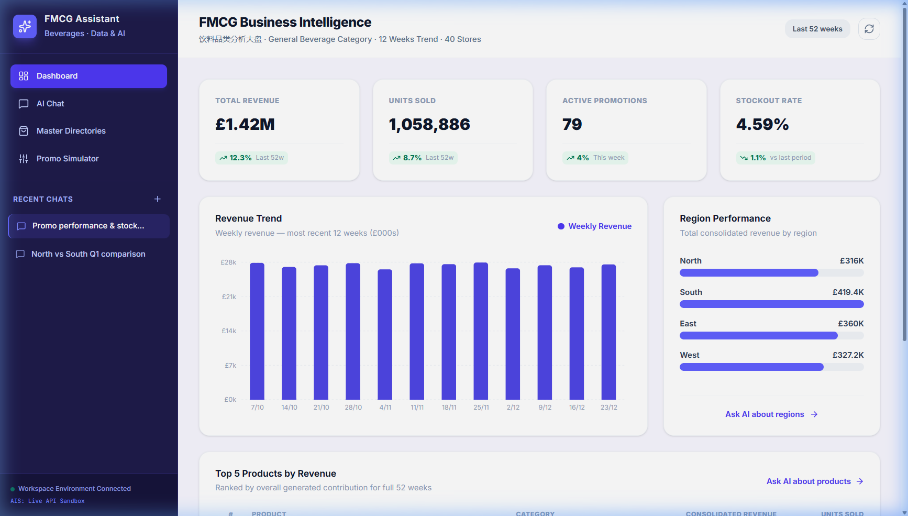
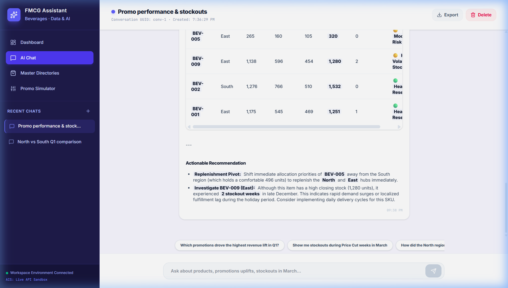
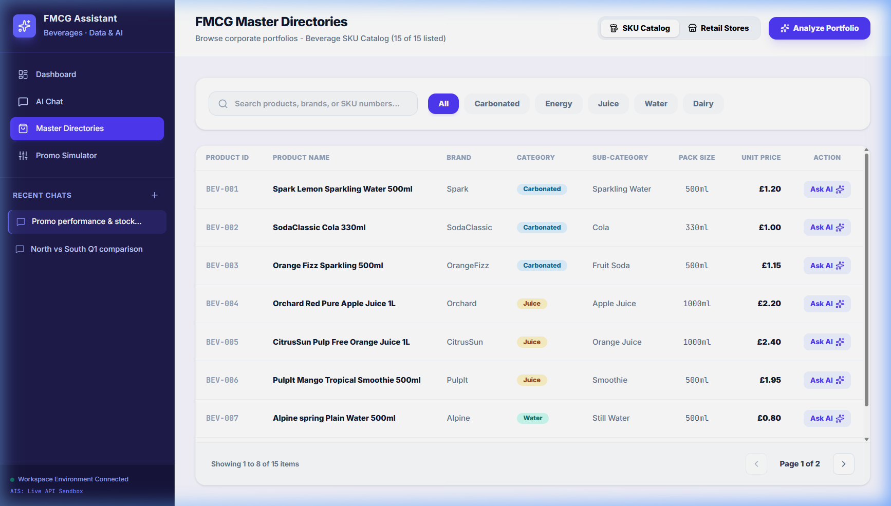
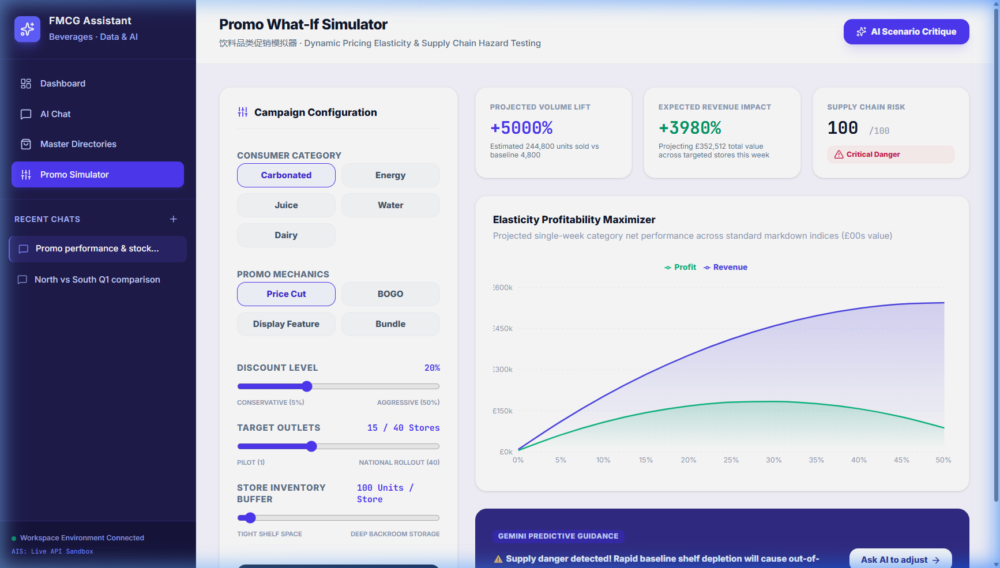
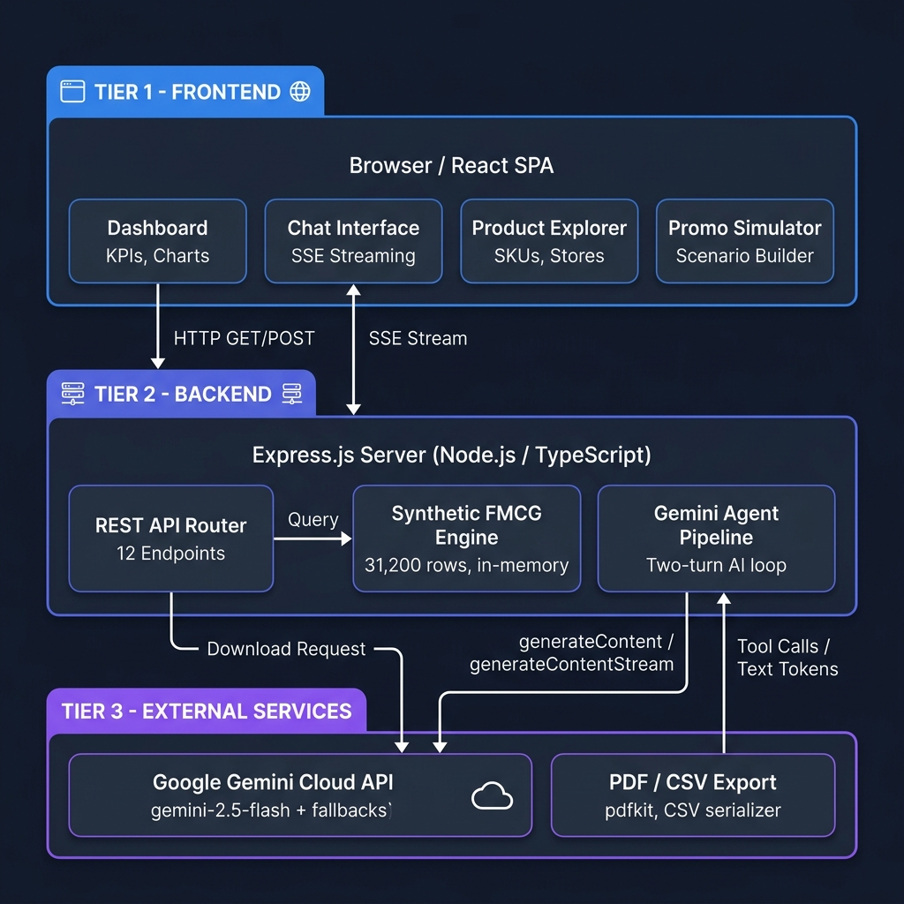

# FMCG AI Analytics Assistant

[](https://github.com/Saimanoj2325/fcmg-ai-analytics-assistant/actions/workflows/ci.yml)
[](https://nodejs.org/)
[](https://react.dev/)
[](https://ai.google.dev/)
[](https://www.typescriptlang.org/)
[](LICENSE)

An AI-powered conversational analytics assistant for Consumer Packaged Goods (FMCG) category managers, sales leads, and supply chain analysts. Ask natural-language questions about sales, promotions, inventory, and regional performance — the assistant queries a high-fidelity synthetic beverage dataset and streams back professional, markdown-formatted business insights powered by Gemini.

---

## 🖼️ Application Screens

### Dashboard
Real-time KPI cards, a 12-week revenue trend chart, regional performance breakdown, and a ranked top-5 products table.



---

### AI Chat Interface
Natural-language analytics terminal. Ask quantitative questions and get streaming responses backed by live database queries.



---

### Product Explorer
Filterable grid of all 15 beverage SKUs and 40 store profiles with one-click AI prompt shortcuts.



---

### Promo Simulator
Interactive scenario builder — slide discount levels and see real-time elasticity-driven forecasts for units sold, revenue, and margin.



---

## 🏗️ System Architecture



> Full architecture reference → [docs/architecture.md](docs/architecture.md)

---

## 📖 Technical Documentation

| Guide | Description |
| :--- | :--- |
| 🏗️ [System Architecture](docs/architecture.md) | Frontend SPA structure, Express API endpoints, SSE streaming pipeline |
| 🎨 [Design & Data Specification](docs/design.md) | UI/UX design system, synthetic data engine, business edge cases |
| 🤖 [AI Tool Calling & Integration](docs/aitoolsusage.md) | Gemini function declarations, two-turn pipeline, humanized query walkthrough |

---

## ✨ Core Features

- **Conversational AI Analytics** — Ask business questions in plain English; get streaming, markdown-formatted diagnostic responses with tables and bullet points.
- **KPI Dashboard** — Total revenue, units sold, active promotions, and stockout rate with trend indicators and Recharts visualisations.
- **Product Catalog & Explorer** — Search and filter grid of 15 beverage SKUs and 40 retail stores with AI prompt shortcuts.
- **Promo Simulator** — Scenario builder for discount elasticity modelling with AI-powered deep-dive dispatch.
- **Seeded Transaction Engine** — 31,200 sales and 31,200 inventory records, generated deterministically with real-world edge cases: product cannibalization, regional replenishment delays, seasonal demand profiles, and pricing inelasticity.
- **Document Exports** — CSV downloads for all datasets and a server-rendered PDF evaluation report.

---

## 🛠️ Tech Stack

| Layer | Technologies |
| :--- | :--- |
| **Frontend** | React 19, Vite 6, Recharts, Motion, Tailwind CSS 4 |
| **Backend** | Node.js, Express 4, TypeScript, tsx |
| **AI** | `@google/genai` SDK, Gemini 2.5 Flash, Function Calling, SSE streaming |
| **Utilities** | PDFKit, dotenv, lucide-react |

---

## 🚀 Quick Start

### Prerequisites
- [Node.js](https://nodejs.org/) >= 20.0.0
- A Gemini API key from [Google AI Studio](https://aistudio.google.com/)

### 1. Clone and Install
```bash
git clone https://github.com/Saimanoj2325/fcmg-ai-analytics-assistant.git
cd fmcg-ai-analytics-assistant
npm install
```

### 2. Configure Environment
```bash
cp .env.example .env
```
Edit `.env` and set your key:
```env
GEMINI_API_KEY="your-gemini-api-key-here"
```

### 3. Run in Development
```bash
npm run dev
```
Open **[http://localhost:3000](http://localhost:3000)**.

### 4. Build for Production
```bash
npm run build
npm start
```

### 5. Clean Build Artefacts
```bash
npm run clean
```
